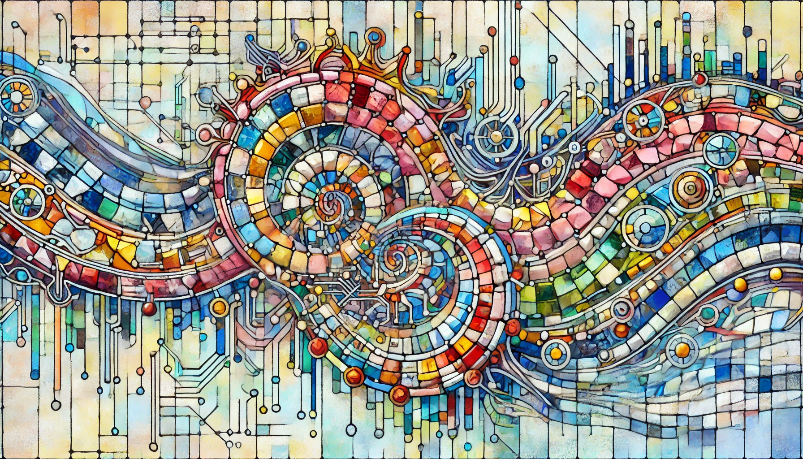

> The package is named `gaudi`, inspired by the renowned Spanish architect Antoni Gaudí, who was famous for his intricate and colorful mosaics. Just as Gaudí pieced together countless fragments of tiles to create stunning, cohesive artworks, this package brings together various pieces of multi-omics data to form a comprehensive picture of complex biological systems. The concept of a mosaic beautifully parallels the integration of diverse data types, illustrating how individual fragments (genes, proteins, metabolites, etc.) come together to reveal the larger, more intricate patterns within biological research.

# GAUDI

The `gaudi` package provides a streamlined solution for the integration and analysis of complex multi-omics data. Leveraging the power of UMAP (Uniform Manifold Approximation and Projection), this package offers researchers an efficient and intuitive approach to uncover hidden patterns and relationships within diverse biological datasets. Designed for ease of use and compatibility with existing R-based bioinformatics workflows, `gaudi` is ideal for both novice and experienced users looking to delve deeper into the world of multi-omics research.  

## Installation

To install the latest GitHub version:

``` r
# install.packages("devtools")
devtools::install_github("hirscheylab/gaudi")
```

## Method Performance and Validation

For an in-depth understanding of the GAUDI (Group Aggregation via UMAP Data Integration) method's performance and its comparative analysis with other leading multi-omics integration techniques, we encourage users to explore our dedicated benchmarking repository. This repository contains detailed benchmarks across various datasets, including simulated data, TCGA cancer datasets, single-cell datasets, and DepMap multi-omics data, providing valuable insights into the effectiveness and versatility of the GAUDI approach. Access the comprehensive benchmarks and results [here](https://github.com/hirscheylab/umap_multiomics_integration).

## Citation

``` bibtex
@article {Castellano-Escuder2024.10.07.617035,
	author = {Castellano-Escuder, Pol and Zachman, Derek K and Han, Kevin and Hirschey, Matthew D},
	title = {Interpretable multi-omics integration with UMAP embeddings and density-based clustering},
	elocation-id = {2024.10.07.617035},
	year = {2024},
	doi = {10.1101/2024.10.07.617035},
	publisher = {Cold Spring Harbor Laboratory},
	URL = {https://www.biorxiv.org/content/early/2024/10/11/2024.10.07.617035},
	eprint = {https://www.biorxiv.org/content/early/2024/10/11/2024.10.07.617035.full.pdf},
	journal = {bioRxiv}
}
```

